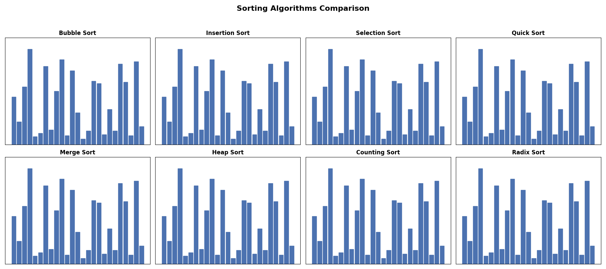

<div align="center">

# 📊 Sorting Algorithm Visualizer (C)

### Learn Data Structures & Algorithms Through Interactive Step-by-Step Visualization

A console-based application written in **C** that demonstrates the working of **8 classical sorting algorithms** through step-by-step visualization of comparisons, swaps, merges, partitions, and heap operations. The project also includes a **Random Array Generator** for quick algorithm testing.


[](https://interactive-sorting-visualizer-zeta.vercel.app/)

</div>

---

## 📸 Demo

<p align="center">
  
</p>

<p align="center">
  <em>Interactive visualization of all implemented sorting algorithms.</em>
</p>

---

# 🎯 Project Objective

The **Sorting Algorithm Visualizer** is an educational console-based application developed in **C** to help students understand how classical sorting algorithms work internally. Instead of only displaying the final sorted array, the program visualizes every significant operation, making it easier to analyze algorithm behavior, efficiency, and implementation techniques.

---

# 📚 Table of Contents

- ✨ Features
- 🛠️ Tech Stack
- 🎲 Input Options
- 📖 Algorithms Included
- 🚀 Project Highlights
- 📊 Time Complexity
- 🛠️ Project Structure
- 🚀 Getting Started
- ▶️ Sample Execution
- 🧠 Concepts Covered
- 🎓 Educational Value
- ⚠️ Limitations
- 🔮 Possible Enhancements
- 🤝 Contributing
- 📄 License
- 👨‍💻 Author

---

# ✨ Features

- 📌 Visualizes **8 classical sorting algorithms**
- 🎲 Built-in **Random Array Generator**
- 🔄 Step-by-step visualization of comparisons and swaps
- 📋 Interactive menu-driven interface
- 🎯 Highlights active elements during sorting
- ⚡ Bubble Sort with early-exit optimization
- 📚 Beginner-friendly DSA learning tool
- 🧩 Modular and well-structured C code

---

# 🛠️ Tech Stack

| Category | Technology |
|----------|------------|
| Language | C |
| Compiler | GCC |
| Platform | Console |
| Concepts | Data Structures & Algorithms |

---

# 🎲 Input Options

Users can choose between:

- ✍️ Manual array input
- 🎲 Randomly generated array

The random array generator allows quick testing without manually entering values.

---

# 📖 Algorithms Included

| Algorithm | Description |
|------------|-------------|
| 🫧 Bubble Sort | Repeatedly swaps adjacent out-of-order elements |
| 📝 Insertion Sort | Inserts each element into its correct position |
| 🎯 Selection Sort | Finds the minimum element and places it correctly |
| ⚡ Quick Sort | Divide-and-conquer using pivot partitioning |
| 🔀 Merge Sort | Splits arrays and merges sorted halves |
| 🌳 Heap Sort | Builds a max heap and repeatedly extracts the largest |
| 🔢 Counting Sort | Frequency-based sorting for non-negative integers |
| 🔟 Radix Sort | Digit-by-digit sorting using Counting Sort |

---

# 🚀 Project Highlights

✅ Step-by-step visualization

✅ Interactive menu-driven program

✅ Covers both comparison and non-comparison sorting

✅ Demonstrates recursion and divide-and-conquer

✅ Beginner-friendly implementation

✅ Interview-ready concepts

---

# 📊 Time Complexity

| Algorithm | Best | Average | Worst | Space | Stable |
|------------|------|----------|--------|-------|--------|
| Bubble Sort | O(n) | O(n²) | O(n²) | O(1) | ✅ |
| Insertion Sort | O(n) | O(n²) | O(n²) | O(1) | ✅ |
| Selection Sort | O(n²) | O(n²) | O(n²) | O(1) | ❌ |
| Merge Sort | O(n log n) | O(n log n) | O(n log n) | O(n) | ✅ |
| Quick Sort | O(n log n) | O(n log n) | O(n²) | O(log n) | ❌ |
| Heap Sort | O(n log n) | O(n log n) | O(n log n) | O(1) | ❌ |
| Counting Sort | O(n+k) | O(n+k) | O(n+k) | O(k) | ✅ |
| Radix Sort | O(d(n+k)) | O(d(n+k)) | O(d(n+k)) | O(n+k) | ✅ |

---

# 🛠️ Project Structure

```text
interactive_sorting_visualizer
│
├── sorting_visualizer.c
├── README.md
├── LICENSE
└── assets
    ├── sorting_comparison.gif
    └── output.png
```

---

# 🚀 Getting Started

## Clone Repository

```bash
git clone https://github.com/sibanandsahu38/interactive_sorting_visualizer.git
cd interactive_sorting_visualizer
```

## Compile

```bash
gcc sorting_visualizer.c -o sorting_visualizer
```

## Run

### Linux / macOS

```bash
./sorting_visualizer
```

### Windows

```bash
sorting_visualizer.exe
```

---

# ▶️ Sample Execution

```text
Choose Input Method

1. Manual Input
2. Random Array

Choice: 2

Generated Array:
48 12 95 37 61

Choose Sorting Algorithm:
1. Bubble Sort
2. Insertion Sort
...
```

---

# 🧠 Concepts Covered

- Arrays
- Functions
- Recursion
- Divide and Conquer
- Binary Heap
- Heapify
- Counting Technique
- Random Number Generation
- Stable vs Unstable Sorting
- Time Complexity Analysis
- Space Complexity
- Modular Programming

---

# 🎓 Educational Value

This project demonstrates:

- Classical Sorting Algorithms
- Divide-and-Conquer Strategy
- Heap Operations
- Recursion
- Algorithm Visualization
- Random Test Case Generation
- Time & Space Complexity Analysis

---

# ⚠️ Limitations

- Maximum array size: 200 elements
- Counting Sort supports only non-negative integers
- Radix Sort supports only non-negative integers
- Console-based visualization

---

# 🔮 Possible Enhancements

- Support negative integers in Counting Sort
- Add performance comparison graph
- Enhance visualization with ANSI color output
- Adjustable animation speed
- Export sorting statistics (comparisons, swaps, execution time)

---

# 🤝 Contributing

Contributions, suggestions, and improvements are welcome.

If you'd like to improve this project, feel free to fork the repository and submit a pull request.

---

# 📄 License

This project is licensed under the **MIT License**.

---

# 👨‍💻 Author

**Sibanand Sahu**

🎓 Computer Science (AI & ML)

💻 Passionate about Data Structures, Competitive Programming, and Software Development.

---

# ⭐ Support

If you found this project useful, consider giving it a ⭐ on GitHub.

It motivates me to build more educational and open-source projects.

---

<div align="center">

### 🚀 Happy Coding!
